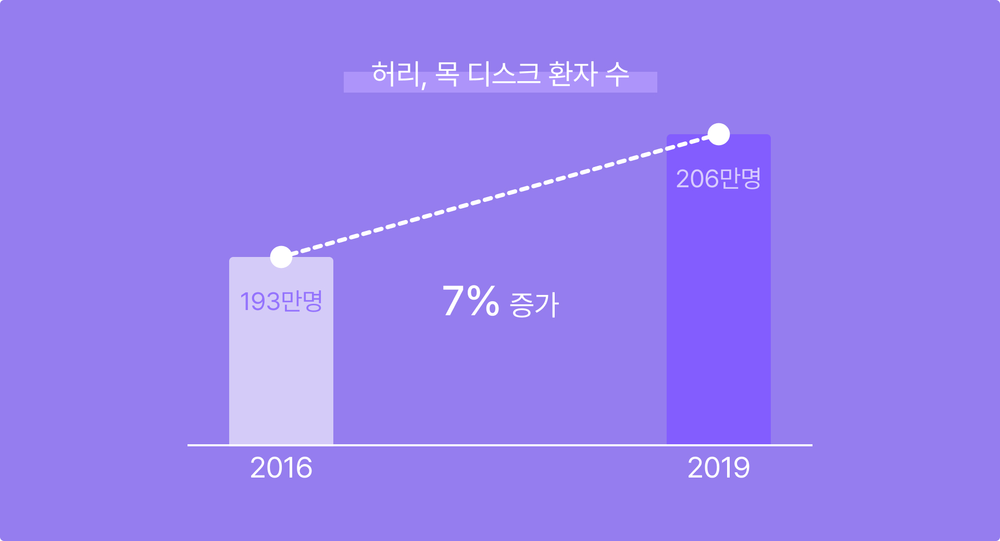
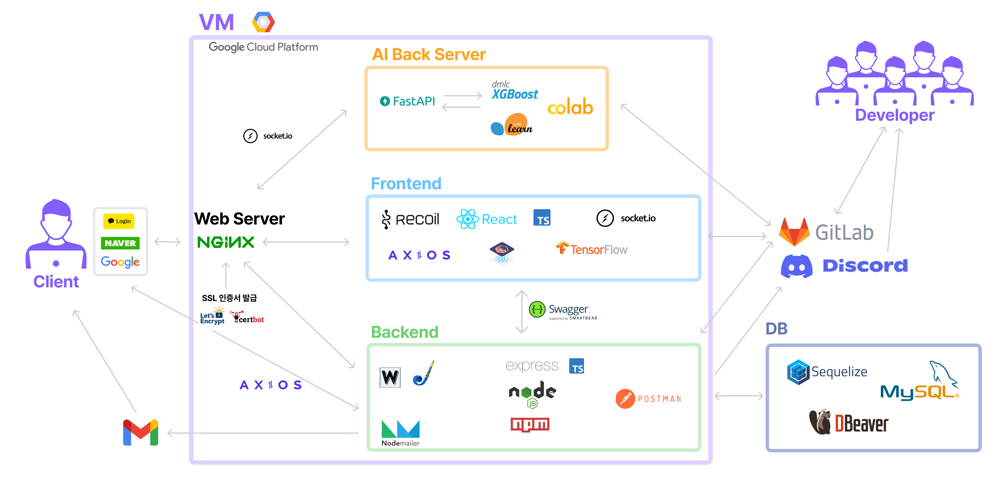

# 서비스 소개

## 오늘도 근무 중인 당신에게, CHAIR COACH
CHAIR COACH는 현대인들의 신체 건강 악화를 막기 위해,
앉은 자세에서도 쉽게 할 수 있는 AI 스트레칭 자세를 제공하는 서비스입니다.  
 

## 기능 소개
**1. AI 스트레칭**  
AI 실시간 자세 교정을 통해 정확한 자세를 알려줍니다.  
- 시작 전 웹캠의 위치 설정 안내
- 컴퓨터 웹캠을 통한 AI 자세 인식 (상체 중심)
- 운동 난이도 선택 : 간단, 기본, 심화 스트레칭
- 타이머

  

**2. 거북목 진단**  
인공지능을 통해 거북목 여부를 체크해드립니다.  
- Pose Estimation을 통한 목과 어깨 사이의 각도를 측정한 간단한 거북목 진단 서비스
- 서베이를 통한 자가 진단 서비스

  

**3. 푸시 알람**  
15분, 30분, 1시간 단위로 스트레칭 시간을 알려드립니다.  
 

**4. 기록 통계 / 조회**  
스트레칭 시간을 리포트 형식으로 나타내주고, 거북목 진단결과를 기록해줍니다.
- DashBoard
- 년간/주간 운동 시간
- 거북목 진단 결과  
   

**5. 회원가입 및 로그인**
- 간편 로그인 (구글, 카카오, 네이버)
- 이메일 인증

  

## 서비스 배경 
현대인들의 신체 건강은 점점 악화되고 있습니다.  
장시간 근무, 야근 등 오랜 시간 동안 같은 자세로 근무하는 현대인들이 많아짐에 따라, 허리 디스크, 목 디스크와 같은 질병 환자 수는 2016년 193만명에서 2019년 206만명으로 3년만에 7%정도 증가한 추이를 보이고 있습니다.
 

   

# 프로젝트
## 프로젝트 구조도
  
 

## 기술 스택
|파트|기술|
|------|---|
|FE|`Typescript` `Socket.io` `Chart.js` `Recoil` `Movenet` `StyledComponent`|
|BE|`Typescript` `Node.js` `Express` `MySQL`|
|AI|`Python` `FastAPI` `Socket.io` `scikit-learn`|

 

## 데모 영상
[데모 영상 youtube 바로가기](https://youtu.be/7BNFqBISDG0)  
   

## 팀원 소개
|이름  |포지션   |담당 업무|
|------|--------|--------|
|박근혁  |FE / 팀장| **1. AI 스트레칭 기능**  1-1)Movenet을 활용하여 실시간 유저 관절 좌표 인식 1-2)RAF(request animation frame) 적용 =>setinterval 이용 대비 프레임 누락 방지 및 유저 cpu 부담 최소화 1-3)Socket.io 활용하여 AI 서버와 실시간 소통 =>유저 관절 좌표값을 실시간으로 전송하여, 그에 따른 RES를 받아 UI 적용 **2.거북목 AI진단 기능** 2-1)MoveNet, RAF활용하여 유저의 실시간 관절 좌표 확인 2-2)알고리즘을 활용한 거북목 각도 계산 구현 =>왼쪽, 오른쪽 인식 스코어 비교 후, 이에 따른 유저 거북목 각도 계산 알고리즘 구현 **3. Push Alarm 기능**  유저별 푸쉬 알람 시간 간격, on off 여부를 서버에 저장 후, 이를 활용하여 푸쉬 알람 서비스 진행하였음. **4. Token 활용 Api 통신 설계**  4-1) Access Token  ⇒ 평소 API 통신 시 에는 header에 access token 을 사용하여 통신 진행.  4-2) Access Token 만료 시  ⇒ 로컬 스토리지의 Refresh Token 활용하여 서버에 토큰 재발급 요청  (이 때, 리프레쉬 토큰, 엑세스 토큰 두개 다 재발급)  4-3) axios interceptors  ⇒ axios 통신 진행할 때, 세팅해 놓은 에러코드로 받을 경우, 서버 토큰 갱신 요청 진행. **5. SNS 로그인(구글,네이버,카카오)기능**  각 SNS 로그인 URL 접속 후,  각 사이트에서 URL을 통해 보내는 코드를 searchParams활용하여 서버에 전달 및 로그인 처리 진행.  **6. 거북목 자가진단(서베이) 기능**  1-1)Location State 활용하여 프론트파트에서 구현 진행  
|유민지|FE|**1. 전체 디자인 작업** => 피그마 작업 **2. styled-component를 이용한 CSS 스타일 관리** 2-1) Theme, Global 설정 2-2) button, input 스타일 공용화 2-3) 전반적 CSS 작업 **3. 회원관련 작업** 3-1) 이메일 회원가입, 로그인, 회원정보 변경, 회원탈퇴 3-2) 자주사용될 정규식을 utils에 관리 3-3) Recoil, Local Storage를 이용하여 로그인, 로그아웃 관리 3-4) 불필요한 API 통신 방지를 위한 Warnning문구, check아이콘, disabled 사용 **4. 메인페이지 스크롤 애니메이션** => IntersectionObserver를 활용한 스크롤 애니메이션|
|지수빈|FE|**1. 메인페이지** - styled-component 이용해 컴포넌트 기반 메인페이지 설계 **2. 마이페이지** 2-1) 마이체어 리포트   - Chart.js, styled-components 활용하여 유저의 운동기록 데이터를 년도별, 주차별로 가공하여 Bar 그래프로 출력   2-2) 거북목 진단 결과 - 거북목 진단 결과에 따른 점수를 년도별로 가공하여 Line 그래프로 출력 - 해당 년도 거북목 진단 결과 평균 점수에 따른 결과를 3단계로 분류하여 이모지로 출력 **3. 웹캠 기반 웹페이지에서 소켓 통신** - AI 스트레칭 페이지에서, AI 모델과의 소켓통신이 필요 - nginx reverse proxy로 https가 적용된 환경에서 소켓연결을 위한 wss 설정|
|김병용|BE|**1. 서비스 배포를 고려한 코딩** 1-1) Error Logging ⇒ 로그의 추적 가능성을 고려하여 로깅폼 커스텀 1-2) 외부 API 활용 ⇒ Discord.js를 도입하여 에러 발생 시 빠르게 인지하고 대응할 수 있는 환경 구축 ⇒ Kakao와 Naver 그리고 Google의 Oauth2.0 간편 로그인을 도입하여 사용자의 접근성 향상 **2. 안전한 DB 고려한 코딩** 2-1) Transaction ⇒ DB의 ACID를 보장하기 위해 불완전한 DB 수정은 rollback 되도록 처리 2-2) Event Scheduler ⇒ 만료일이 존재하는 데이터의 확인 및 처리 자동화 2-3) Validation ⇒ Joi를 활용하여 의도하지 않은 타입이나 값이 주입되지 않도록 방지 **3. 보안을 고려한 토큰 관리** 3-1) Refresh token ⇒ 토큰 발급 시 client의 IP 기록/br>⇒ Access/Refresh Token을 활용한 요청에 IP 대조 ⇒ 대조 결과로 토큰 탈취 의심 여부 확인|
|김민아|AI|**1. 모델 학습**   1-1) 데이터 촬영(1300장) 1-2) Movenet으로 인지된 keypoint 좌표 전처리, 1-3) xgboost classifier 알고리즘 사용, SMOTE, K-Fold cross validation 적용  1-4) 학습 결과 F1 score 0.92 1-5) 좌표 normalization을 하여 input 영상의 해상도와 관계없이 동일한 성능 유지 **2. 파이썬 서버 생성** 2-1) 클라이언트 서버와 socketio 연결을 통한 실시간 모델 구현|

